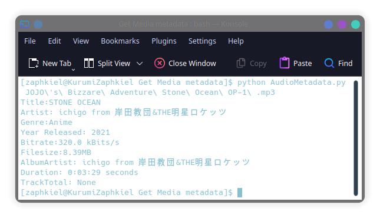

# Get Audio Metadata
This is a simple python script to get audio metadata using Python and it's library Tinytag.

### Dependency: 

#### Python 2.7 and 3.4 or higher

#### tinytag
[tinytag](https://github.com/devsnd/tinytag) is a library for reading music meta data of most common audio files in pure python.

install using ```pip install tinytag```

### Usage:

    python AudioMetadata.py <FileName/Path>

### Screenshot:

